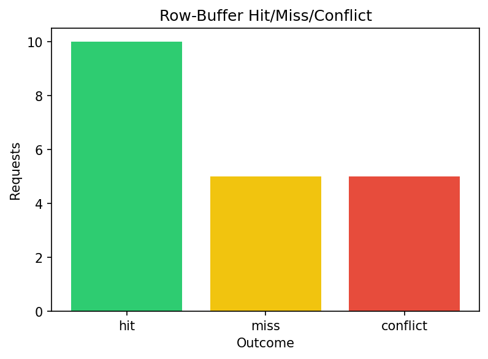
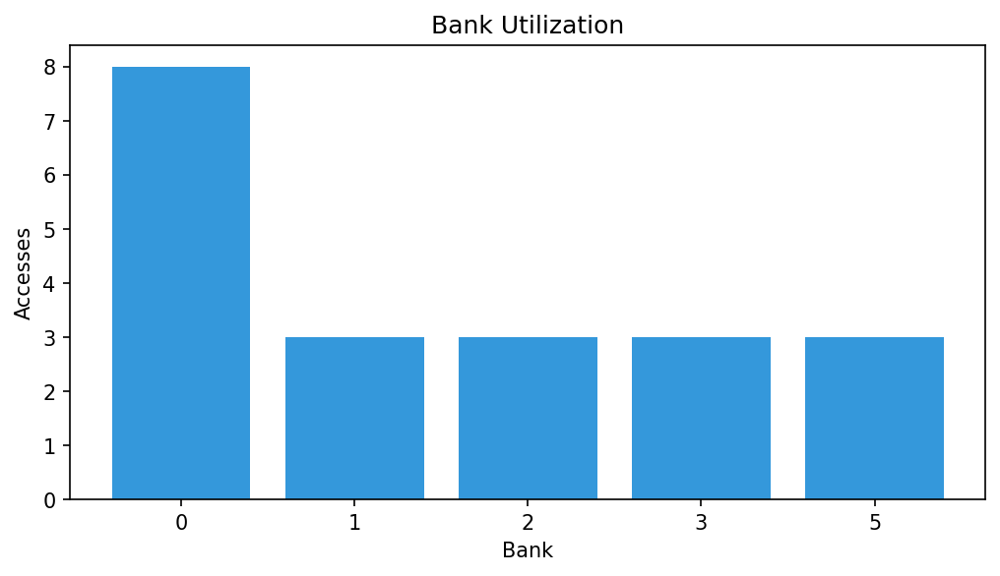
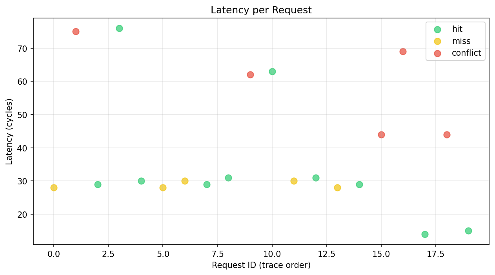
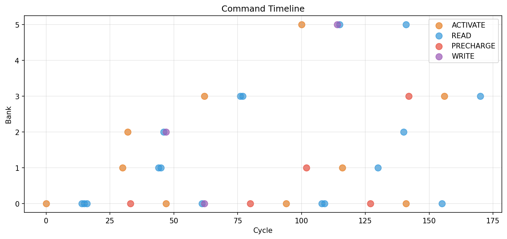
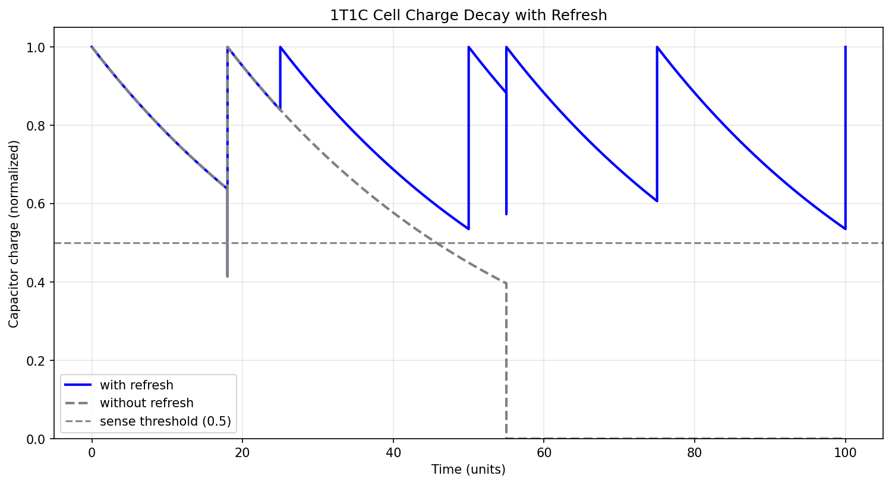

# DRAM Access Simulator (DRAM 접근 시뮬레이터)

[DRAMSim2](https://ieeexplore.ieee.org/document/5713095)와 [Ramulator](https://github.com/CMU-SAFARI/ramulator2)의 구조에서 영감을 받아 만든, Python 기반 **trace-driven DRAM 타이밍 시뮬레이터**입니다. 인터랙티브한 **Streamlit 대시보드**로 시각화합니다.

이 프로젝트는 DRAM 동작을 두 계층으로 연결해서 보여줍니다:

- **Architecture 레벨** — 메모리 컨트롤러가 물리 주소를 DRAM 명령어(`ACTIVATE`, `READ`, `WRITE`, `PRECHARGE`)로 변환하는 과정, 핵심 타이밍 제약(`tRCD`, `tCL`, `tRP`, `tRAS`, `tRC`)을 강제하는 방식, 각 접근을 **row-buffer hit / miss / conflict**로 분류하는 로직, 그리고 **FCFS**와 **FR-FCFS** 스케줄링 비교를 다룹니다.
- **Cell 레벨 (1T1C)** — DRAM cell 자체에 대한 교육용 모델입니다. leakage로 인한 capacitor 전하 감쇠, sense amplifier의 restore를 동반하는 **destructive read**, 주기적인 **refresh**, 그리고 refresh가 너무 늦었을 때 발생하는 현상(retention failure)을 보여줍니다.

 

## 🔗 라이브 데모

**[여기를 클릭하면 브라우저에서 바로 시뮬레이터를 실행할 수 있습니다 →](https://dram-simulator-yoontf0.streamlit.app)**


## 모델링하는 DRAM 개념

### 1. 구조와 주소 매핑
DRAM 시스템은 **Channel → Rank → Bank → Row → Column** 계층으로 구성됩니다. 각 뱅크는 한 번에 하나의 row를 열어두는 **row buffer** (sense amplifier 집합)를 가지고 있습니다. 이 시뮬레이터는 플랫한 물리 주소를 아래 비트 배치(LSB → MSB)로 분해합니다.

```
| row | rank | bank | channel | column |
```

연속된 주소는 같은 row에 머물러 있고 (공간 지역성 → row hit), 서로 다른 row는 여러 뱅크에 분산됩니다 (뱅크 수준 병렬성).

### 2. 명령어와 타이밍
데이터에 접근하려면 컨트롤러는 다음 과정을 거쳐야 합니다:

| 명령어 | 목적 | 제약 조건 |
|---|---|---|
| `ACTIVATE` | row를 뱅크의 row buffer로 로드 | READ/WRITE 전까지 `tRCD` 사이클 소요 |
| `READ` / `WRITE` | 열린 row에 대한 column 접근 | `tCL` 사이클 후 데이터 전달 |
| `PRECHARGE` | 열린 row를 닫음 (뱅크 복구) | 다음 ACTIVATE 전 `tRP` 필요; ACTIVATE 이후 `tRAS` 전에는 불가 |

`tRC` (≈ `tRAS + tRP`)는 같은 뱅크를 다시 activate하는 데 걸리는 최소 시간을 제한합니다.

### 3. Row-buffer 결과
| 결과 | 뱅크 상태 | 명령어 순서 | 지연시간 |
|---|---|---|---|
| **Hit** | 요청한 row가 이미 열려 있음 | `READ` | `tCL` |
| **Miss** | 열린 row 없음 (뱅크 precharge 상태) | `ACT → READ` | `tRCD + tCL` |
| **Conflict** | *다른* row가 열려 있음 | `PRE → ACT → READ` | `tRP + tRCD + tCL` |

### 4. 스케줄링 정책
- **FCFS** — 도착 순서대로 요청을 엄격하게 처리합니다.
- **FR-FCFS** (First-Ready FCFS) — 대기 중인 요청 중 열린 row에 hit하는 가장 오래된 요청을 우선 처리하고, hit이 없으면 가장 오래된 요청을 처리합니다. Row-buffer 지역성을 활용해 burst 패턴의 trace에서 전체 사이클을 줄여줍니다.

### 5. 1T1C 셀 — DRAM이 refresh를 필요로 하는 이유
DRAM의 1비트는 하나의 access transistor 뒤에 있는 작은 capacitor의 전하로 저장됩니다:

```
wordline ─────┐
              │ (gate)
bitline ─────[T]────●────||──── GND
                 storage    C
                  node   capacitor
```

**"1T1C Cell Visualizer"** 탭은 (정규화된 단위로) 다음을 모델링합니다:

| 현상 | 모델 |
|---|---|
| **Leakage (누설)** | 저장된 전하는 `q(t) = q₀ · e^(−t/τ)`로 감쇠 (τ = retention time) |
| **Sensing (감지)** | sense amplifier는 전하 ≥ threshold일 때만 1로 읽음 |
| **Destructive read (파괴적 읽기)** | 읽는 순간 cell 전하가 bitline과 공유됨 (전하 × (1 − share)), 이후 **restore**가 감지된 값을 원래 세기로 다시 기록 |
| **Refresh** | 주기적인 내부 sense + restore; 전하가 threshold를 넘어선 *이후에* refresh가 도착하면 amplifier는 0으로 잘못 감지하고 **잘못된 값**을 복원 → retention failure |
| **Refresh overhead** | 랭크가 refresh로 바쁜 시간 비율 ≈ `tRFC / tREFI` (DDR4 기준 약 4~5%) |

이는 의도적으로 단순화한 교육용 모델이며, transistor 수준의 SPICE 시뮬레이션이 아닙니다.

## 저장소 구조

```
dram-simulator/
├── app.py                  # Streamlit 대시보드 (UI 전용, 탭 2개)
├── requirements.txt
├── README.md
├── src/                    # 시뮬레이터 코어 — Streamlit 의존성 없음
│   ├── dram_config.py      # 구조 + 타이밍 파라미터
│   ├── address_mapper.py   # 주소 → Ch/Rank/Bank/Row/Col
│   ├── dram_bank.py        # 뱅크 상태 머신 + 타이밍 모델
│   ├── scheduler.py        # FCFS / FR-FCFS 정책
│   ├── memory_controller.py# 요청 큐 → 스케줄러 → 뱅크
│   ├── simulator.py        # Trace 로딩, 실행, 통계
│   └── dram_cell.py        # 교육용 1T1C 셀 모델 (leakage/refresh)
├── data/
│   └── sample_trace.csv    # 기본 예시 워크로드
└── tests/
    ├── test_simulator.py   # architecture 레벨 유닛 + end-to-end 테스트
    └── test_dram_cell.py   # cell 레벨 모델 테스트
```

## 빠른 시작

```bash
git clone <your-repo-url> && cd dram-simulator

python -m venv .venv
# Windows:  .venv\Scripts\activate
# macOS/Linux:  source .venv/bin/activate

pip install -r requirements.txt

# 테스트 실행
pytest

# 대시보드 실행
streamlit run app.py
```

http://localhost:8501 을 열어 타이밍 슬라이더를 조정하고, 자신만의 trace를 업로드하고, FCFS와 FR-FCFS를 비교해보세요.

## 시뮬레이션 결과

기본 제공 trace(DDR4 유사 시스템에서 요청 20개)로 얻은 예시 결과입니다:

### Row-Buffer Hit/Miss/Conflict
Trace 전체의 row-buffer 결과를 비교합니다. FR-FCFS는 대기 중인 요청을 재정렬해 더 높은 hit rate를 달성합니다.



### Bank Utilization (뱅크 사용률)
8개 뱅크에 걸친 메모리 요청 분포입니다. 이상적으로는 주소 패턴이 고르게 섞일수록 균등하게 분산됩니다.



### Latency per Request (요청별 지연시간)
각 요청의 지연시간(도착부터 데이터 준비까지의 사이클)을 결과별 색상으로 표시한 산점도입니다. Row hit은 빠르고(`tCL`), conflict는 느립니다(`tRP + tRCD + tCL`).



### Command Timeline (명령어 타임라인)
시간에 따라 각 뱅크에 발행된 DRAM 명령어(ACT/RD/WR/PRE) 순서입니다. 서로 다른 뱅크는 명령어를 병렬로 발행할 수 있습니다 (뱅크 수준 병렬성).



### 1T1C Cell Charge Decay (1T1C 셀 전하 감쇠)
시간에 따른 DRAM cell의 capacitor 전하를 보여주는 교육용 시각화입니다. Leakage, destructive read의 영향, 그리고 값을 유지시켜주는 주기적인 refresh 과정을 확인할 수 있습니다.



## Trace 형식

헤더가 있는 CSV, 한 줄에 요청 하나씩. 주소는 16진수(`0x...`) 또는 10진수 모두 가능하며, `#`으로 시작하는 줄은 주석입니다.

```csv
cycle,address,op
0,0x0000,READ
0,0x4000,READ
30,0xA400,WRITE
```

`cycle`은 메모리 컨트롤러에 요청이 도착하는 시각입니다.

## Streamlit Community Cloud에 배포하기

1. 이 저장소를 GitHub에 push합니다 (public repo).
2. [share.streamlit.io](https://share.streamlit.io)에서 GitHub 계정으로 로그인합니다.
3. **New app** → 저장소/브랜치 선택 → **Main file path**를 `app.py`로 설정 → **Deploy**.

`requirements.txt`는 자동으로 인식되며, 추가 설정은 필요하지 않습니다.

## 모델 단순화 범위 (MVP scope)

이는 controller 레벨의 *타이밍* 시뮬레이터이며, cycle-accurate한 소자 모델이 아닙니다:

- Architecture 레벨 명령어 스트림에는 `REFRESH`, `tCCD`, `tBURST`, 데이터 버스 경합이 포함되지 않습니다 (refresh 물리 현상과 `tRFC/tREFI` overhead는 별도의 1T1C cell 모듈에서 모델링합니다).
- `WRITE` 지연시간은 `tCL`로 근사합니다 (별도의 write-recovery `tWR`은 없음).
- 컨트롤러는 사이클당 하나의 요청을 처리하며, 뱅크별 타이밍 제약이 뱅크 내부의 직렬화를 담당하므로 서로 다른 뱅크로의 접근은 겹칠 수 있습니다.
- Open-page row-buffer 정책만 지원합니다.

이는 의도적인 선택입니다: 목표는 (주소 매핑, 뱅크 상태, 타이밍 제약, 스케줄링 같은) 개념을 **정확하고 읽기 쉽게 모델링**해서, refresh 엔진이나 Ramulator 방식의 표준별 타이밍 테이블 등으로 쉽게 확장할 수 있게 하는 것입니다.

## 참고 문헌

- P. Rosenfeld, E. Cooper-Balis, B. Jacob, *DRAMSim2: A Cycle Accurate Memory System Simulator*, IEEE CAL 2011.
- Y. Kim, W. Yang, O. Mutlu, *Ramulator: A Fast and Extensible DRAM Simulator*, IEEE CAL 2015.
- S. Rixner et al., *Memory Access Scheduling*, ISCA 2000 (FR-FCFS).
